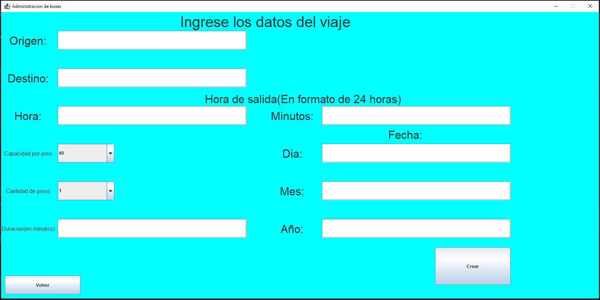
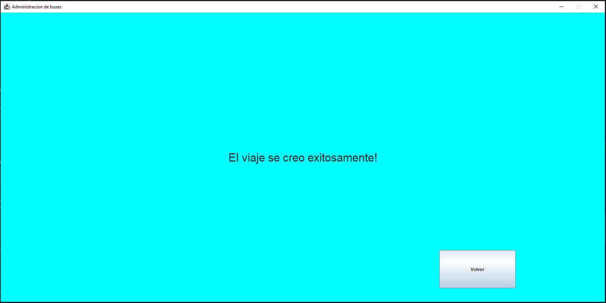
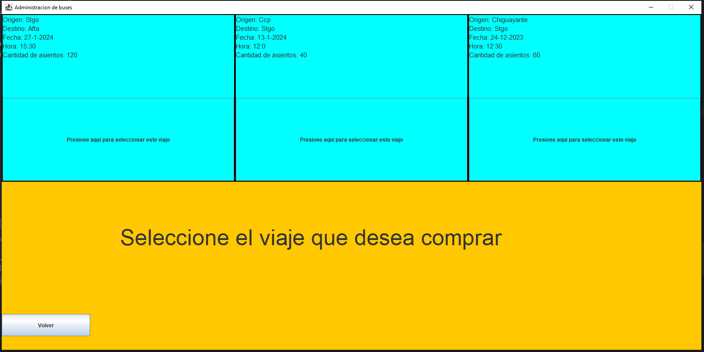
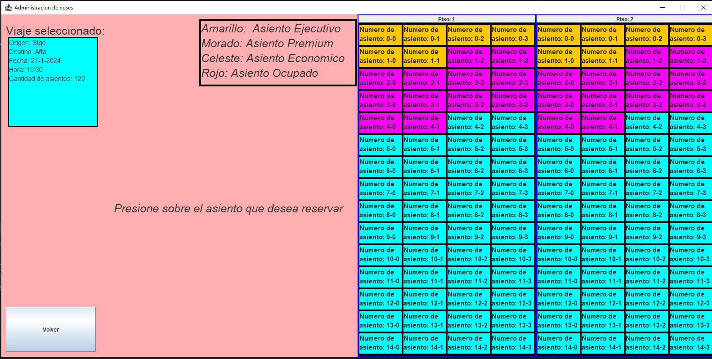
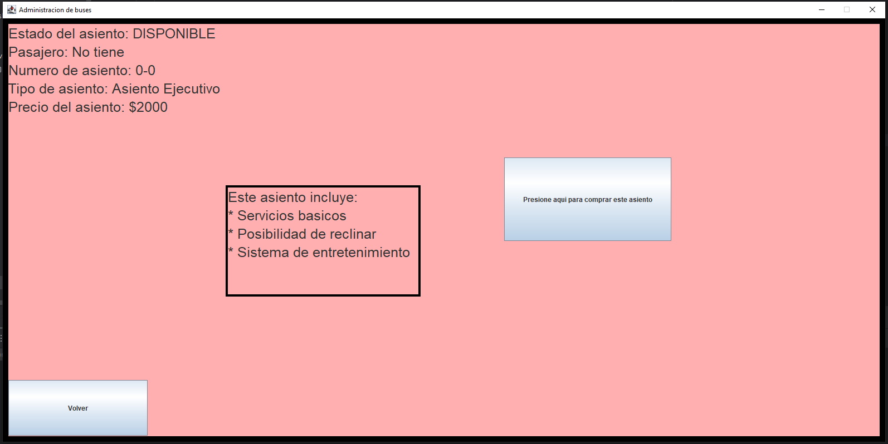
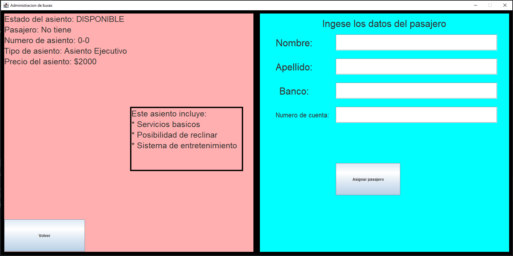
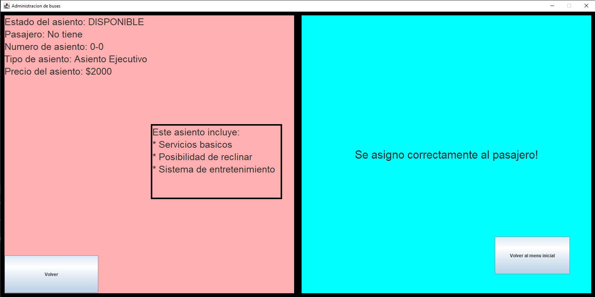
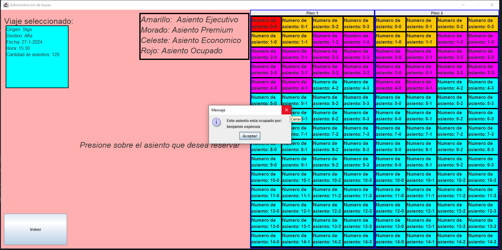
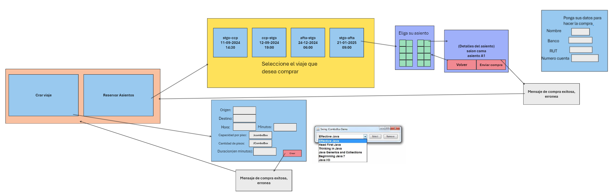

# Proyecto administración de buses programacion 2 (informe)
## Integrantes del grupo
Numero de Grupo: 1
1. Benjamín Espinoza Henriquez (DyStorzion)
2. Carlos Tomás Álvarez Norambuena (Karantooo)
## Enunciado general del proyecto
Lo que realizamos como proyecto semestral fue un sistema de creación de viajes y reserva de asientos para una hipotética empresa de buses. El proyecto está pensado para que un trabajador de la misma pueda crear recorridos a su gusto y poder reservar asientos para posibles clientes que quieran viajar en ellos. A la hora de la compra quisimos imitar cómo funciona por ejemplo el ir a comprar boletos para una función de cine o algún tipo de espectáculo, donde uno como cliente se acerca a la boletería y el empleado es el que manipula el software. Más detalle de cómo funciona lo encontrara en la sección de diagramas y en las capturas de pantalla. No realizamos grandes cambios en comparación del enunciado original del proyecto.

## Diagramas
### Diagrama de casos de uso de nuestro sistema de buses

Diagrama de caso de uso.

### Diagrama UML de nuestro sistema de buses

Diagrama UML

## Capturas de pantalla del proyecto.

Nada más iniciar el programa se va a lanzar el siguiente panel:

La idea es que el trabajador de la empresa decida si quiere crear un viaje o reservar un asiento para el cliente. 

### Crear viaje
Si decide crear un viaje se hace click en el botón izquierdo y le mostraría el siguiente panel:

Aquí el usuario puede introducir los diferentes datos del viaje que quiere crear.

Una vez introducidos los datos se presiona al botón crear lo que deberia de mostrar una de 2 opciones:

Aparecerá este panel si se crea exitosamente el viaje.
.png)
Aparecerá este panel si se ingresaron mal los datos.

### Reservar asiento
Si escogemos reservar asiento nos aparecerá el siguiente menú.

Aquí se tiene que escoger a que viaje se desea acceder. Si antes de acceder a este menú el usuario no crea 3 viajes por el mismo, el programa va a generar 3 viajes por defecto que son los que se observan en la imagen.

Si se selecciona un viaje aparecerá algo similar a esto:

Si se selecciona uno de estos asientos te muestra un panel con la información especifica a ese asiento. Mostraría algo similar a lo siguiente:

Si se da click al botón de la derecha mostraría lo siguiente:

Si se ingresan datos inválidos se muestra:
.png)

Caso contrario:

Si se quisiese comprar un asiento que ya está reservado por otro pasajero mostraría el siguiente mensaje:

## Elección de los patrones de uso:
En nuestro proyecto ocupamos el patrón de diseño builder 2 veces, en la creacion de buses y en la creación de asientos.
### Builder para la creación de buses.
 Para el caso de los buses nos pareció lógico utilizar un builder ya que estos cuando se crean pueden tener distintos tipos de especificaciones, por ejemplo, tener que escoger si tiene 1 o 2 pisos, escoger la cantidad de pasajeros, ... Una solución precaria ante este problema sería especificar todos esos parámetros en el constructor de la clase, pero esto produciría un constructor con una gran cantidad de parámetros. Para eso escogimos el patrón builder para poder "construir" de una manera mucho más limpia los diferentes tipos de buses. De cualquier manera, creamos un director para este builder con unos buses predefinidos, pero a la hora de la verdad solo se utilizan para los recorridos que vienen por defecto.

 ### Builder para la creación de asientos 
 Aquí, como grupo nos debatimos entre diferentes patrones de diseño, pero las 3 opciones que sobresalieron fueron las de hacerlo con un factory, un decorator o un builder. La idea con los asientos es crear asientos con una cierta jerarquía. Que hubiese una categoría económica, una ejecutiva y una premium. 
 - Hicimos una factory para solucionar este problema, pero la verdad al ver la implementación pensamos que en verdad no se estaba solucionando ningún problema y que estábamos solamente instanciando los diferentes tipos de asientos de una manera más complicada por lo que lo descartamos.
 - Después vino la opción del decorator que si bien nos permitía de buena manera definir que distintos tipos de asientos tuvieran diferentes cosas (por ejemplo, que ciertos asientos tuvieran un sistema de entretenimiento y otros no) sentíamos que la manera de instanciar cada asiento era aún demasiado complicada y no tan automatizada como realmente queríamos.
 - La última opción (y la que escogimos) fue la de realizar un builder junto a un director. El builder nos permitía escoger de manera precisa que características queríamos en cada asiento tal como el decorator. Además permite que en caso de ser necesario poder añadir nuevos tipos de características de manera no tan complicada (por ejemplo, que ciertos asientos tengan salidas de escape, cosa que no añadimos, pero podría añadirse sin mucho problema). Con el director pudimos tener ciertos tipos de asientos que se crearan de manera más automatizada con lo que pudimos crear fácilmente las diferentes clases del bus.

## Decisiones tomadas en el proyecto
Para realizar este proyecto hicimos primero que nada un boceto de como creíamos lógica realizar la interfaz gráfica. El boceto es el siguiente:

Se puede notar fácilmente que realizamos bastantes cambios desde la versión "prototipo" y la versión final de la misma. 

- La primera decisión lógica que tomamos fue dividir el programa en 2 apartados, la de crear viaje y la de reservar un asiento.

- Por razones de simplicidad decidimos cambiar la manera en como se muestra los asientos ya que la manera como lo dejamos en el resultado final era más practica ya que mostraba más información además de ser más fácil de programar al ser solamente un gridLayout.
- Otra decisión importante fue la de los patrones de diseño que ya aclaramos en el ítem anterior.
- A la hora de empezar el proyecto realizamos un diagrama UML solamente con las clases a manera de guiarnos y de estructurar las fases iniciales del proyecto. 

Esas serían las decisiones más relevantes que tomamos en el desarrollo del proyecto. 

## Autocritica
En general diría que estructuramos bien el trabajo, espaciamos bien los tiempos de desarrollo, había una buena comunicación entre los integrantes del grupo y en general si teníamos una duda sobre el proyecto siempre nos dábamos una buena retroalimentación. Lo único que nos podríamos echar en cara es el hecho de que la primera semana y media del desarrollo del proyecto no trabajamos casi nada en el mismo, salvo crear el diagrama de casos de uso y el boceto del proyecto. A parte de eso consideramos que hicimos un buen trabajo. 

## Instalación
Simplemente hacer un git clone del repositorio https://github.com/Karantooo/ProyectoProgra2 y abrir la carpeta con intellij.
