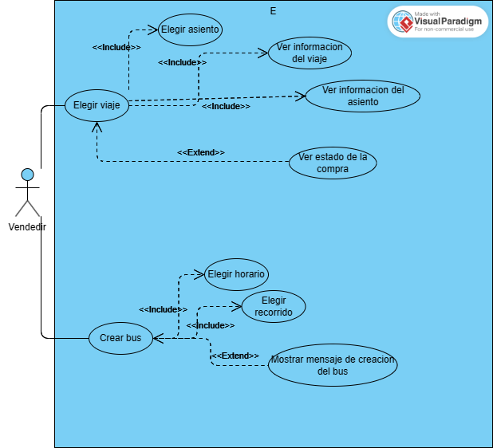

# Proyecto administración de buses programacion 2
## Integrantes del grupo
Numero de Grupo: 1
1. Benjamín Espinoza Henriquez (DyStorzion)
2. Carlos Tomás Álvarez Norambuena (Karantooo)
## Enunciado general del proyecto
Lo que realizamos como proyecto semestral fue un sistema de creacion de viajes y reserva de asientos para una hipotetica empresa de buses. El proyecto esta pensado para que un trabajador de la misma pueda crear recorridos a sus gusto y poder reservar asientos para posibles clientes que quieran viajar en ellos. A la hora de la compra quisimos imitar como funciona por ejemplo el ir a comprar boletos para una funcion de cine o algún tipo de espectaculo, donde uno como cliente se acerca a la boleteria y el empleado es el que manipula el software. Más detalle de como funciona lo encontrara en la seccion de diagramas y en las capturas de pantalla. No realizamos grandes cambios en comparacion del enunciado original del proyecto.

## Diagramas
### Diagrama de casos de uso de nuestro sistema de buses

Diagrama de caso de uso.

### Diagrama UML de nuestro sistema de buses

Diagrama UML

## Capturas de pantalla del proyecto.

Nada más iniciar el programa se va a lanzar el siguiente panel:

La idea es que el trabajador de la empresa decida si quiere crear un viaje o resevar un asiento para el cliente. 

### Crear viaje
Si decide crear un viaje se hace click en el botón izquierdo y le mostraria el siguiente panel:

Aquí el usuario puede introducir los diferentes datos del viaje que quiere crear.

Una vez introducidos los datos se presiona al botón crear lo que deberia de mostrar una de 2 opciones:

Aparecera este panel si se crea exitosamente el viaje.
.png)
Aparecera este panel si se ingresaron mal los datos.

### Reservar asiento
Si escogemos reservar asiento nos aparecera el siguiente menu.

Aqui se tiene que escoger a que viaje se desea acceder. Si antes de acceder a este menu el usuario no crea 3 viajes por el mismo, el programa va a generar 3 viajes por defecto que son los que se observan en la imagen.

Si se selecciona un viaje aparecera algo similar a esto:

Si se slecciona uno de estos asientos te muestra un panel con la informacion especifica a ese asiento. Mostraria algo similar a lo siguiente:

Si se da click al botón de la derecha  mostraria lo siguiente:

Si se ingresan datos inválidos se muestra:
.png)

Caso contrario:

Si se quisiese comprar un asiento que ya esta reservado por otro pasajero mostraria el siguiente mensaje:

## Eleccion de los patrones de uso:
En nuestro proyecto ocupamos el patron de diseño builder 2 veces, en la creacion de buses y en la creacion de asientos.
### Builder para la creación de buses.
 Para el caso de los buses nos parecio lógico utilizar un builder ya que estos cuando se crean pueden tener distintos tipos de especificaciones, por ejemplo tener que escoger si tiene 1 o 2 pisos, escoger la cantidad de pasajeros,... Una solución precaria ante este problema seria especificar todos esos parametros en el constructor de la clase, pero esto produciria un constructor con una gran cantidad de parametros. Para eso escogimos el patrón builder para poder "construir" de una manera mucho más limpia los diferentes tipos de buses. De cualquier manera creamos un director para este builder con unos buses predefinidos, pero a la hora de la verdad solo se utilizan para los recorridos que vienen por defecto.

 ### Builder para la creación de asientos 
 Aquí, como grupo nos debatimos entre diferentes patrones de diseño, pero las 3 opciones que sobresalieron fueron las de hacerlo con un factory, un decorator o un builder. La idea con los asientos es crear asientos con una cierta jerarquia. Que hubiese una categoria economica, una ejecutiva y una premium. 
 - Hicimos una factory para solucionar este problema, pero la verdad al ver la implementacion pensamos que en verdad no se estaba solucionando ningún problema y que estabamos solamente instanciando los diferentes tipos de asientos de una manera más complicada por lo que lo descartamos.
 - Despues vino la opción del decorator que si bien nos permitia de buena manera definir que distintos tipos de asientos tuvieran diferentes cosas (por ejemplo que ciertos asientos tuvieran un sistema de entretenimiento y otros no) sentiamos que la manera de instanciar cada asiento era aun demasiado complicada y no tan automatizada como realmente queriamos.
 - La última opción (y la que escogimos) fue la de realizar un builder junto a un director. El builder nos permitia escoger de manera precisa que caracteristicas queriamos en cada asiento tal como el decorator. Ademas permite que en caso de ser necesario poder añadir nuevos tipos de caracteristicas de manera no tan complicada (por ejemplo que ciertos asiento tengan salidas de escape, cosa que no añadimos pero podria añadirse sin mucho problema). Con el director pudimos tener ciertos tipos de asientos que se crearan de manera mas automatizada con lo que pudimos crear facilmente las diferentes clases del bus.